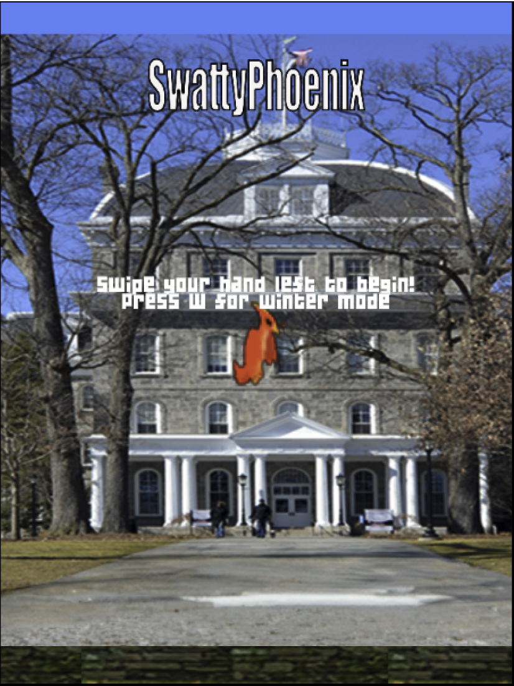
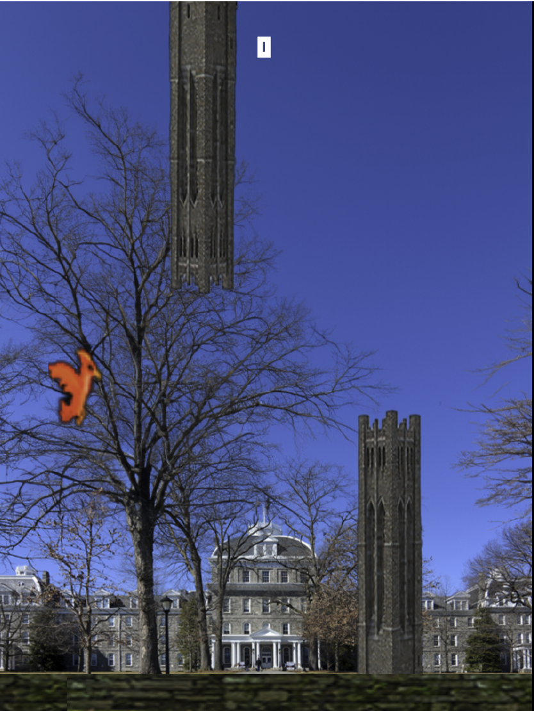
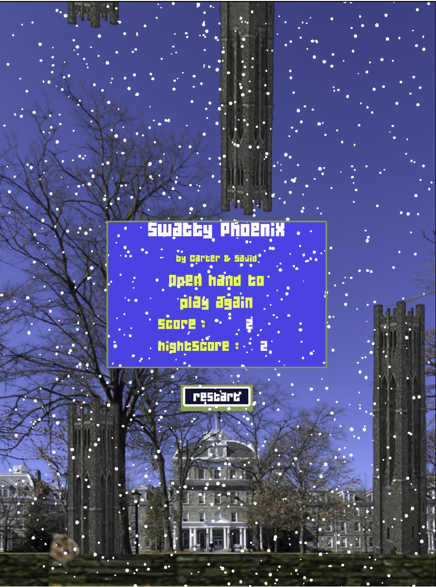

# Playing Flappy Bird using Hand Gesture

As part of my Computer Vision learnings, I implemented "Flappy Phoenix" -- a modified version of Flappy Bird game which can be played 100% using only hand gesture.

## Technologies used
I used a ml5.js model called Handpose that allows the user to detect both the user’s palms as well as points across each of their
fingers. The model itself derives from the TensorFlow.js handpose implementation, but I opted to follow the ml5.js model, as opposed to the TensorFlow.js model, because the ml5.js model offers a more beginner-friendly API approach better suited for computer vision projects. The hand pose model works by first locating the hand within the input image, and then identifying the fingers relative to the palm, while mapping landmarks across the entire cropped hand live image/feed. This provides the user with the keypoint localization of 21 hand-knuckle coordinates across the hand by relying upon an SSD architecture (single shot
multibox detector). While I wouldn’t go too deep here, the SSD architecture allows user to pass over the image/webcam feed while generating multiple bounding boxes that ultimately predict where exactly the hand, fingers, and palm are within the canvas. While my detections array stores 21 total points for mappings across each finger, I chose to solely focus on the tip of the user’s index finger and thumb. 

Once we index the user’s finger and thumb in the canvas, we store the location of each data point in an array called ‘detections’ and call our ‘drawLandmarks’ function to draw the data points on the screen and the lines between each landmark. With this data, we do three main steps. The first is we trigger the game if the user’s index finger crosses over into the right-most third of the screen. In other words, a hand movement left triggers the game to begin. The second functionality component is that we trigger the flappy bird sprite to jump vertically on the screen if the user’s index finger crosses the median y value (the midline of the camera canvas). In other words, this is like saying if the hand moves into the top half of the screen, the user is indicating a hand raise, and thus the bird must jump. Finally, the third component, or action trigger, is after the user has died, if the distance between the user’s index finger and thumb crosses a threshold (i.e. the user’s hand expands), restart the game.

## How to Play

When launched, the user will see a screen of themselves in the top left corner, as well as a game screen on the middle of their device. The user must first display their hand on the screen and then move their hand to the left most part of the canvas to trigger gameplay. The user also has the option to enter 'winter mode' should they care, by simply pressing the 'w' key at any time. 

To move the phoenix up, the user must move their hand up into the top half of their canvas to trigger the sprite to jump vertically. Then the user should return their hand to the lower part of the canvas so that when the user chooses to raise their hand again, there is room for the computer to register the vertical movement. 

Should the user unfortunately die, all they need to do is stretch their hand out causing the bird to re-spawn and start the game again.

## Gameplay Simulation

## References

Hand-Detection:  https://drive.google.com/file/d/1sv4sSb9BSNVZhLzxXJ0jBv9DqD-4jnAz/view

ml5.js: https://learn.ml5js.org/#/reference/handpose
TensorFlow.js: https://github.com/tensorflow/tfjs-models/tree/master/face-detection
SSD:
https://arxiv.org/abs/1512.02325
https://developers.arcgis.com/python/guide/how-ssd-works/
Actual Flappy-Bird: https://codepen.io/ju-az/pen/eYJQwLx
